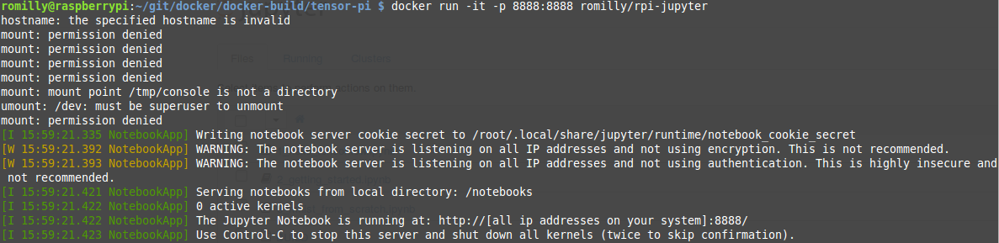
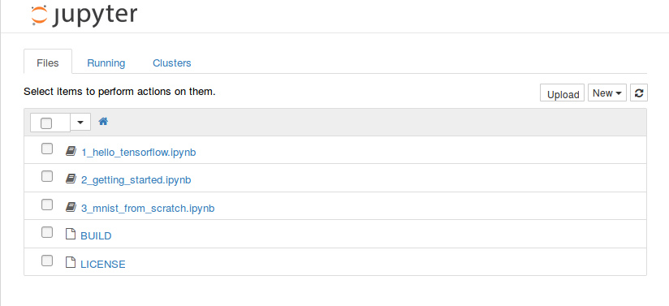

# rpi-docker-tensorflow

This is the build environment I used to create a docker image for the
Raspbery Pi which contains tensorflow, jupyter and two tensorflow
notebooks copied from the official Google docker tensorflow build.

The build relies heavily on the work of resin.io, Sam Abrahams and
the Google tensorflow team. Sources are listed below.

This is **not** an official tensorflow port, so don't ask for or expect
support from the tensorflow team.

I've done minimal testing and only tried the build and run the image
on a Raspberry Pi Model 3B with Raspbian Jessie.

## Build instructions

Step 1 is lightly updated from
https://github.com/umiddelb/armhf/wiki/Get-Docker-up-and-running-on-the-RaspberryPi-(ARMv6)-in-four-steps-(Wheezy) .

1. Install Docker on your Raspberry Pi.
  1. `curl -sSL http://downloads.hypriot.com/docker-hypriot_1.10.3-1_armhf.deb >/tmp/docker-hypriot_1.10.3-1_armhf.deb`
  1. `sudo dpkg -i /tmp/docker-hypriot_1.10.3-1_armhf.deb`
  1. `rm -f /tmp/docker-hypriot_1.10.3-1_armhf.deb`
  1. `sudo sh -c 'usermod -aG docker $SUDO_USER'`
  1. `sudo systemctl enable docker.service`
1. Clone this repository into a directory of your choice
  1. `git clone https://github.com/romilly/rpi-docker-tensorflow.git`
1. Build the image
  1. `cd rpi-docker-tensorflow\build-tensor-pi\`
  1. `docker build -t='yourName/rpi-docker-tensorflow' .`

## Running the image

`docker run -it -p 8888:8888 yourName/rpi-docker-tensorflow`

If you see warnings like those in this screenshot you can ignore them.

## Connecting to the notebooks

Open a browser on `http://raspberrypi:8888` where raspberrypi is the
hostname of the Pi on which the docker image is running, or on
`http://localhost:8888` on the Pi itself.

You should see a screen like this:

aaand you're away to the races!

I'll [blog](http://blog.rareschool.com/) more info about this shortly,
and will commit the image to docker central.

# Sources

1. Docker: https://github.com/umiddelb/armhf/wiki/Get-Docker-up-and-running-on-the-RaspberryPi-(ARMv6)-in-four-steps-(Wheezy)
1. [Base image](https://hub.docker.com/r/resin/rpi-raspbian/): from [a post by the chaps at resin.io](https://resin.io/blog/docker-on-raspberry-pi-in-4-simple-steps/)
1. [Pi tensorflow whl file](https://github.com/samjabrahams/tensorflow-on-raspberry-pi/raw/master/bin/tensorflow-0.9.0-cp27-none-linux_armv7l.whl)
from [Sam Abrahm's Github project](https://github.com/samjabrahams/tensorflow-on-raspberry-pi)
1. Notebooks and notebook config from [The Tensorflow Docker Build on Github](https://github.com/tensorflow/tensorflow/tree/master/tensorflow/tools/docker)

   
 
 

